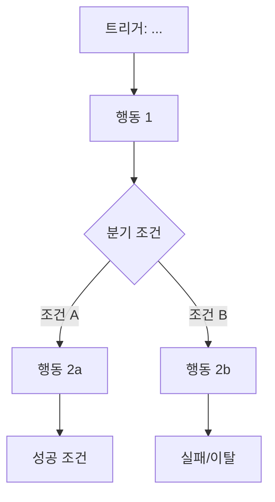
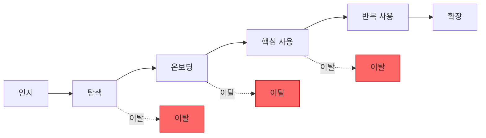

# Variables
- $$requirements = plan_requirement_analyzer의 결과 (서비스 개요 + FR/NFR 목록)
- $$user_types = plan_user_classifier의 결과 (사용자 유형 + 페르소나)
- $$depth = 기획 깊이 (light / standard / deep)

# Rules
- $$variable 형식으로 변수 참조
- 각 Step 완료후 다음 Step 진행 전 결과를 명시적으로 서술.
- $$depth에 따라 산출물의 상세 수준을 조절한다.
  - light: 사용자 유형별 핵심 시나리오 1~2개, Journey Map 간략
  - standard: 사용자 유형별 시나리오 3~5개, Journey Map 상세
  - deep: 사용자 유형별 시나리오 5개 이상, Journey Map 심층 + 감정곡선 포함

## Errors/Exception Handling
- $$user_types가 부족하여 행동패턴 설계 불가 → 부모 Context에 보고, 보완 요청
- 사용자 유형과 기능 요구사항 간 매핑 불일치 → 부모 Context에 보고

---
# Action

## Step 1. 사용자-기능 매핑
$$requirements의 FR 목록과 $$user_types의 사용자 유형을 교차 매핑한다:
- 각 사용자 유형이 주로 사용하는 기능 식별
- 기능별 주요 사용자 유형 지정
- 매핑 매트릭스 작성 (사용자 유형 × 기능)

```
| 기능 \ 사용자 | UT-001 | UT-002 | UT-003 |
|---|---|---|---|
| FR-001 | ● 주 사용 | ○ 부 사용 | - |
| FR-002 | - | ● 주 사용 | ○ 부 사용 |
...
```

## Step 2. 핵심 행동 시나리오 도출
각 사용자 유형별로 핵심 행동 시나리오를 작성한다.

### 출력 형식
```
[BS-{번호}] {시나리오 제목} (대상: UT-{번호})
- 트리거: {이 행동을 시작하게 되는 계기/상황}
- 목표: {사용자가 달성하려는 목표}
- 사전 조건: {시나리오 시작 전 충족되어야 할 조건}
- 행동 흐름:
  1. {행동 1}
  2. {행동 2}
  3. {행동 3}
  ...
- 성공 조건: {시나리오가 성공적으로 완료된 상태}
- 실패/이탈 지점: {사용자가 포기하거나 이탈할 수 있는 지점}
- 관련 기능: FR-{번호}, FR-{번호}
- 플로우차트:

```

> 플로우차트는 각 시나리오의 행동 흐름을 Mermaid flowchart 문법으로 시각화한다.
> 분기, 반복, 이탈 지점을 명시적으로 표현할 것.

## Step 3. User Journey Map 설계
각 사용자 유형별 전체 서비스 여정을 단계별로 설계한다.

### Journey 단계
1. **인지(Awareness)**: 서비스를 처음 알게 되는 단계
2. **탐색(Exploration)**: 서비스를 탐색하고 가치를 파악하는 단계
3. **가입/온보딩(Onboarding)**: 서비스에 진입하는 단계
4. **핵심 사용(Core Usage)**: 주요 기능을 사용하는 단계
5. **반복 사용(Retention)**: 지속적으로 서비스를 이용하는 단계
6. **확장(Expansion)**: 추가 기능을 활용하거나 타인에게 추천하는 단계

### 출력 형식
```
[JM-{번호}] Journey Map: {사용자 유형명} (UT-{번호})

| 단계 | 행동 | 접점(Touchpoint) | 감정 | Pain Point | 기회(Opportunity) |
|---|---|---|---|---|---|
| 인지 | ... | ... | ... | ... | ... |
| 탐색 | ... | ... | ... | ... | ... |
| 온보딩 | ... | ... | ... | ... | ... |
| 핵심 사용 | ... | ... | ... | ... | ... |
| 반복 사용 | ... | ... | ... | ... | ... |
| 확장 | ... | ... | ... | ... | ... |
```

> $$depth가 deep인 경우, 각 단계에 감정곡선(Emotion Curve) 수치를 추가:
> - 매우 불만(-2) / 불만(-1) / 보통(0) / 만족(+1) / 매우 만족(+2)

### Journey 플로우차트
각 사용자 유형별 전체 여정을 Mermaid flowchart로 시각화한다:

> 각 단계 간 전환율, 주요 이탈 지점, 분기를 플로우차트에 반영한다.
> 서비스 특성에 따라 단계를 추가/변형할 수 있다.

## Step 4. 핵심 전환 지점 식별
Journey Map에서 특히 중요한 전환 지점을 식별한다:
- **Aha Moment**: 사용자가 서비스의 핵심 가치를 체감하는 순간
- **Drop-off Point**: 이탈 위험이 높은 지점
- **Conversion Point**: 무료→유료, 탐색→가입 등 전환이 발생하는 지점
- 각 전환 지점별 개선 방향 제안

## Step 5. 행동패턴 요약 및 검증
도출된 결과를 종합 정리한다:
- 행동 시나리오 총 수 (사용자 유형별 분포)
- Journey Map 총 수
- 핵심 전환 지점 목록
- 사용자 유형별 주요 Pain Point 요약

## Step 6. 부모 Context로 전달
아래 구조로 결과를 부모 Context에 반환한다:
```
## 사용자 행동패턴 설계 결과

### 사용자-기능 매핑 매트릭스
(매핑 테이블)

### 행동 시나리오
[BS-001] ...
[BS-002] ...
...

### Journey Map
[JM-001] ...
[JM-002] ...
...

### 핵심 전환 지점
- Aha Moment: ...
- Drop-off Point: ...
- Conversion Point: ...

### 요약
- 행동 시나리오: N개 (UT-001: n개, UT-002: n개, ...)
- Journey Map: N개
- 핵심 전환 지점: N개
```
