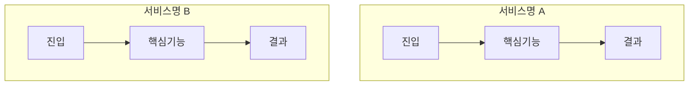

# Variables
- $$idea = 사용자의 러프한 아이디어 텍스트
- $$requirements = plan_requirement_analyzer의 결과 (서비스 개요 + FR/NFR 목록)
- $$depth = 기획 깊이 (light / standard / deep)

# Rules
- $$variable 형식으로 변수 참조
- 각 Step 완료후 다음 Step 진행 전 결과를 명시적으로 서술.
- $$depth에 따라 산출물의 상세 수준을 조절한다.
  - light: 유사 서비스 3개 이내, 기능 비교표 위주
  - standard: 유사 서비스 3~5개, 기능 비교 + 강약점 분석
  - deep: 유사 서비스 5개 이상, 심층 벤치마크 + 차별화 전략 도출

## Errors/Exception Handling
- 유사 서비스를 찾지 못한 경우 → 도메인을 확장하여 재검색, 그래도 없으면 부모 Context에 보고
- WebSearch/WebFetch 실패 → 검색 키워드를 변경하여 재시도, 최대 3회

---
# Action

## Step 1. 검색 키워드 도출
$$idea와 $$requirements를 분석하여 유사 서비스 검색 전략을 수립한다:
- **1차 키워드**: 서비스 도메인 + 핵심 기능 조합
- **2차 키워드**: 해결하려는 문제 + 대상 사용자 조합
- **3차 키워드**: 영문 키워드 (글로벌 서비스 탐색용)
- 검색 대상: 국내 서비스 + 해외 서비스

## Step 2. 유사 서비스 탐색
키워드를 활용하여 유사 서비스를 탐색한다:
- WebSearch로 서비스 목록 수집
- 각 서비스의 공식 사이트/앱스토어 페이지를 WebFetch로 확인
- 서비스별 기본 정보 수집

### 수집 항목
```
[CS-{번호}] {서비스명}
- URL: {공식 사이트 URL}
- 운영사: {운영 회사명}
- 출시일: {출시 연도}
- 지역: 국내 / 해외
- 플랫폼: Web / iOS / Android / Desktop
- 사용자 규모: {알려진 경우}
- 비즈니스 모델: 무료 / 프리미엄 / 구독 / 광고 등
- 한줄 설명: {서비스 핵심 소개}
```

## Step 3. 기능 비교 분석
$$requirements의 FR 목록을 기준으로 유사 서비스와 기능을 비교한다.

### 기능 비교 매트릭스
```
| 기능 | 우리 서비스(예정) | CS-001 | CS-002 | CS-003 |
|---|---|---|---|---|
| FR-001: {기능명} | ● 예정 | ● 있음 | ○ 부분 | ✕ 없음 |
| FR-002: {기능명} | ● 예정 | ✕ 없음 | ● 있음 | ● 있음 |
...
```

### 비교 플로우차트
각 유사 서비스의 핵심 사용자 흐름을 Mermaid flowchart로 시각화한다:

> 서비스별 핵심 흐름의 차이점을 시각적으로 비교할 수 있도록 작성한다.

## Step 4. 강약점 분석 (SWOT 기반)
각 유사 서비스별 강점/약점을 분석한다:

### 출력 형식
```
[CS-{번호}] {서비스명} 강약점 분석
- 강점(Strengths):
  - {강점 1}
  - {강점 2}
- 약점(Weaknesses):
  - {약점 1}
  - {약점 2}
- 우리 서비스에의 시사점: {벤치마크할 점 또는 차별화 포인트}
```

## Step 5. 차별화 포인트 도출
유사 서비스 분석을 종합하여 우리 서비스의 차별화 전략을 제안한다:
- **기능 차별화**: 경쟁 서비스에 없는 기능
- **경험 차별화**: UX/UI 관점에서의 차이
- **가격 차별화**: 비즈니스 모델 관점
- **기술 차별화**: 기술적 우위 포인트

### 포지셔닝 맵 (텍스트)
2가지 축을 기준으로 서비스 포지셔닝을 시각화한다:
```
                    [축1: 예) 기능 다양성]
                         높음
                          │
              CS-002 ●    │    ● 우리 서비스(목표)
                          │
         낮음 ────────────┼──────────── 높음 [축2: 예) 사용 편의성]
                          │
              CS-003 ●    │    ● CS-001
                          │
                         낮음
```

> $$depth가 deep인 경우, 차별화 포인트별 실행 난이도와 임팩트를 평가하여
> 우선순위 매트릭스(Impact vs Effort)를 추가한다.

## Step 6. 유사 서비스 조사 요약 및 검증
도출된 결과를 종합 정리한다:
- 조사 서비스 총 수 (국내/해외 분포)
- 기능 커버리지 현황 (경쟁사 대비 우리 서비스)
- 핵심 차별화 포인트 목록
- 추가 조사가 필요한 영역

## Step 7. 부모 Context로 전달
아래 구조로 결과를 부모 Context에 반환한다:
```
## 유사 서비스 조사 결과

### 유사 서비스 목록
[CS-001] ...
[CS-002] ...
...

### 기능 비교 매트릭스
(비교 테이블)

### 서비스별 핵심 흐름 플로우차트
(Mermaid flowchart)

### 강약점 분석
(서비스별 SWOT)

### 차별화 전략
- 기능 차별화: ...
- 경험 차별화: ...
- 포지셔닝 맵: ...

### 요약
- 조사 서비스: N개 (국내: n, 해외: n)
- 핵심 차별화 포인트: N개
```
