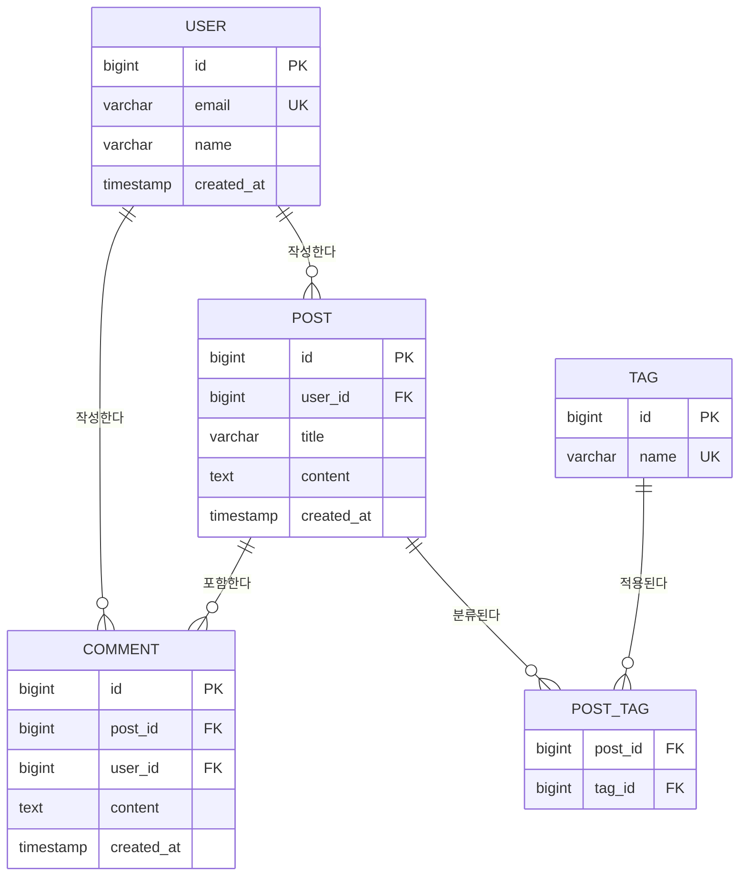

# Variables
- $$requirements = plan_requirement_analyzer의 결과 (서비스 개요 + FR/NFR 목록)
- $$screens = plan_interface_designer의 결과 (인터페이스 설계)
- $$depth = 기획 깊이 (light / standard / deep)

# Rules
- $$variable 형식으로 변수 참조
- 각 Step 완료후 다음 Step 진행 전 결과를 명시적으로 서술.
- $$depth에 따라 산출물의 상세 수준을 조절한다.
  - light: 주요 엔티티 목록 + 간략 관계도
  - standard: 전체 엔티티 정의 + ERD + 관계 정의 + 핵심 제약조건
  - deep: standard + 정규화 근거 + 인덱스 방향 + 데이터 볼륨 추정 + 마이그레이션 고려사항

## Errors/Exception Handling
- 선행 결과 부족 → 부모 Context에 보고, 보완 요청
- 엔티티 간 관계 모호 → 부모 Context에 보고, 판단 요청

---
# Action

## Step 1. 데이터 요구사항 분석
$$requirements의 FR/NFR과 $$screens를 분석하여 데이터 관점의 요구사항을 도출한다:
- **핵심 도메인 객체**: 서비스에서 다루는 주요 데이터 대상 식별
- **데이터 생명주기**: 생성 → 조회 → 수정 → 삭제/보관 패턴 파악
- **데이터 특성**: 정형/비정형, 읽기·쓰기 비율, 예상 데이터 볼륨
- **데이터 관계 복잡도**: 1:1, 1:N, N:M 관계 예측
- **비기능 요구사항 반영**: 성능, 보안, 감사(audit) 요구사항이 데이터 모델에 미치는 영향

## Step 2. 엔티티 정의
도출된 도메인 객체를 기반으로 엔티티를 정의한다.

### 출력 형식
```
[ENT-{번호}] {엔티티명}
- 설명: {엔티티의 목적과 역할}
- 관련 기능: FR-{번호}, FR-{번호}
- 관련 화면: SC-{번호}, SC-{번호}
- 주요 속성:
  - {속성명} ({데이터 타입}) : {설명} [PK/FK/UQ/NN 등 제약조건]
  - {속성명} ({데이터 타입}) : {설명}
  - ...
- 데이터 특성:
  - 예상 레코드 수: {초기 / 1년 후 / 3년 후}
  - 쓰기 빈도: 높음 / 보통 / 낮음
  - 조회 빈도: 높음 / 보통 / 낮음
```

> $$depth가 light인 경우 "데이터 특성" 항목을 생략한다.

## Step 3. 관계 정의
엔티티 간의 관계를 정의한다.

### 출력 형식
```
[REL-{번호}] {엔티티A} ↔ {엔티티B}
- 관계 유형: 1:1 / 1:N / N:M
- 관계 설명: {비즈니스 규칙에 따른 관계 설명}
- FK 위치: {FK가 위치하는 엔티티}
- 참조 무결성: CASCADE / SET NULL / RESTRICT
- (N:M인 경우) 중간 테이블: {중간 테이블명 + 추가 속성}
```

## Step 4. ERD (Mermaid)
전체 엔티티와 관계를 Mermaid erDiagram으로 시각화한다.

### 출력 형식


> 엔티티 수가 많을 경우, 도메인별로 ERD를 분리하여 작성한다.
> $$depth가 deep인 경우, 전체 ERD 외에 도메인별 상세 ERD도 추가한다.

## Step 5. 핵심 제약조건 및 인덱스 방향
데이터 무결성과 성능을 위한 제약조건 및 인덱스 방향을 정의한다.

### 제약조건
```
[CON-{번호}] {제약조건명}
- 대상: ENT-{번호}.{속성명}
- 유형: UNIQUE / CHECK / NOT NULL / DEFAULT / CUSTOM
- 규칙: {제약 규칙 설명}
- 사유: {왜 이 제약조건이 필요한지}
```

### 인덱스 방향
```
[IDX-{번호}] {인덱스명}
- 대상: ENT-{번호}.{속성명} [, {속성명}]
- 유형: B-Tree / Hash / GIN / GiST / Composite
- 근거: {해당 인덱스가 필요한 쿼리 패턴 또는 성능 요구사항}
```

> $$depth가 light인 경우 이 단계를 생략한다.
> $$depth가 deep인 경우, 인덱스 선택 근거를 쿼리 패턴과 함께 상세히 기술한다.

## Step 6. 정규화 검토
> $$depth가 light인 경우 이 단계를 생략한다.

현재 설계의 정규화 수준을 검토한다:
- **정규형 수준**: 각 엔티티의 정규형 (1NF / 2NF / 3NF / BCNF)
- **의도적 비정규화**: 성능을 위해 의도적으로 비정규화한 부분과 그 근거
- **잠재적 이상 현상**: 삽입/수정/삭제 이상 가능성 점검

> $$depth가 deep인 경우, 정규화/비정규화 트레이드오프를 상세히 분석한다.

## Step 7. DB 모델링 요약 및 검증
도출된 결과를 종합 정리한다:
- 엔티티 총 수 (도메인별 분포)
- 관계 총 수 (유형별 분포: 1:1, 1:N, N:M)
- FR 커버리지: 모든 FR이 최소 1개 엔티티에 매핑되었는지 확인
- 고아 엔티티 여부: 어떤 관계에도 포함되지 않는 엔티티 확인
- 화면-엔티티 매핑: 각 화면에서 필요한 데이터가 엔티티에 반영되었는지 확인

## Step 8. 부모 Context로 전달
아래 구조로 결과를 부모 Context에 반환한다:
```
## DB 모델링 결과

### 데이터 요구사항
(분석 결과)

### 엔티티 정의
[ENT-001] ...
[ENT-002] ...
...

### 관계 정의
[REL-001] ...
[REL-002] ...
...

### ERD
(Mermaid erDiagram)

### 제약조건 및 인덱스
(depth가 standard 이상인 경우)
[CON-001] ...
[IDX-001] ...
...

### 정규화 검토
(depth가 standard 이상인 경우)

### 요약
- 엔티티: N개
- 관계: N개 (1:1: n, 1:N: n, N:M: n)
- FR 커버리지: N/N (100%)
- 제약조건: N개
- 인덱스: N개
```
