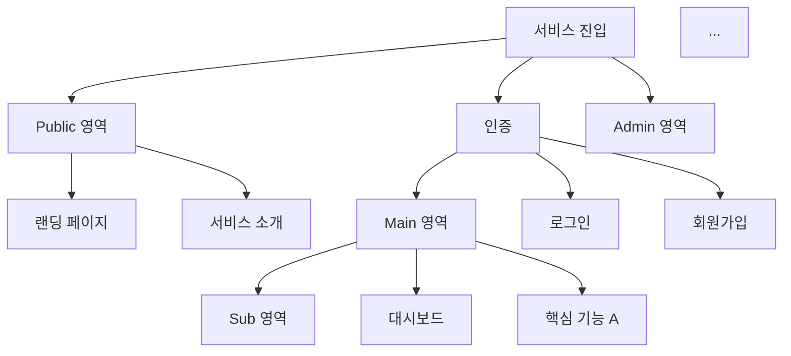
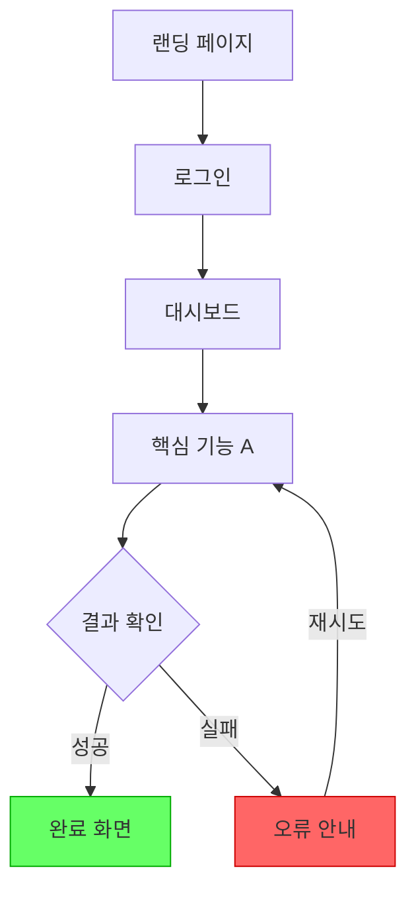

# Variables
- $$requirements = plan_requirement_analyzer의 결과 (서비스 개요 + FR/NFR 목록)
- $$user_types = plan_user_classifier의 결과 (사용자 유형 + 페르소나)
- $$competitors = plan_competitor_researcher의 결과 (유사 서비스 조사)
- $$behaviors = plan_behavior_designer의 결과 (행동패턴 + Journey Map)
- $$depth = 기획 깊이 (light / standard / deep)

# Rules
- $$variable 형식으로 변수 참조
- 각 Step 완료후 다음 Step 진행 전 결과를 명시적으로 서술.
- $$depth에 따라 산출물의 상세 수준을 조절한다.
  - light: 핵심 화면 5~8개, 전체 흐름 flowchart 1개
  - standard: 화면 10~15개, 사용자 유형별 흐름 flowchart
  - deep: 전체 화면 목록, 상세 흐름 + 화면별 구성요소 명세

## Errors/Exception Handling
- 선행 결과 부족 → 부모 Context에 보고, 보완 요청
- 기능과 화면 간 매핑 불일치 → 부모 Context에 보고

---
# Action

## Step 1. 화면 목록 도출
$$requirements의 FR 목록과 $$behaviors의 행동 시나리오를 기반으로 필요한 화면을 도출한다.

### 화면 분류 체계
- **Public**: 비로그인 상태에서 접근 가능한 화면
- **Auth**: 인증 관련 화면 (로그인, 회원가입 등)
- **Main**: 핵심 기능 화면
- **Sub**: 부가/상세 화면
- **Admin**: 관리자 전용 화면
- **System**: 시스템 화면 (에러, 로딩, 설정 등)

### 출력 형식
```
[SC-{번호}] {화면명}
- 분류: Public / Auth / Main / Sub / Admin / System
- 설명: {화면의 목적과 역할}
- 대상 사용자: UT-{번호}
- 관련 기능: FR-{번호}, FR-{번호}
- 진입 경로: {어디에서 이 화면으로 오는지}
- 이동 경로: {이 화면에서 어디로 갈 수 있는지}
```

## Step 2. 전체 화면 흐름 (Site Map)
전체 화면 간의 계층 구조를 Mermaid flowchart로 시각화한다:


## Step 3. 사용자 유형별 User Flow
각 사용자 유형의 주요 시나리오에 대한 화면 이동 흐름을 설계한다.

### 출력 형식
```
[UF-{번호}] User Flow: {시나리오명} (대상: UT-{번호})
- 시작: SC-{번호}
- 목표: {사용자가 달성하려는 목표}
```

### 플로우차트
각 User Flow를 Mermaid flowchart로 시각화한다:

> 분기(조건), 반복(재시도), 이탈(에러/취소)을 명시적으로 표현한다.
> 성공 경로는 녹색, 실패/이탈 경로는 적색으로 스타일링한다.

## Step 4. 화면별 구성요소 명세
각 화면에 포함되어야 할 주요 구성요소를 정의한다.

### 출력 형식
```
[SC-{번호}] {화면명} - 구성요소 명세
- 헤더:
  - {네비게이션, 로고, 사용자 정보 등}
- 본문:
  - {주요 컨텐츠 영역 설명}
  - {입력 폼 / 리스트 / 카드 등 UI 패턴}
- 액션:
  - {CTA 버튼, 링크 등 사용자 행동 유도 요소}
- 상태:
  - 로딩: {로딩 시 표시}
  - 빈 상태: {데이터 없을 때 표시}
  - 에러: {오류 시 표시}
```

> $$depth가 light인 경우 이 단계를 생략한다.
> $$depth가 deep인 경우, 각 구성요소에 대해 와이어프레임 수준의 레이아웃을 ASCII art로 표현한다.

## Step 5. 화면 전환 규칙 정의
화면 간 전환에 대한 공통 규칙을 정의한다:
- **인증 가드**: 비인증 사용자 접근 시 리다이렉트 규칙
- **권한 가드**: 권한 없는 화면 접근 시 처리 규칙
- **뒤로가기**: 각 화면의 뒤로가기 동작 정의
- **딥링크**: 직접 URL 접근 시 동작 정의
- **에러 처리**: 화면 로딩 실패 시 공통 처리

## Step 6. 화면 설계 요약 및 검증
도출된 결과를 종합 정리한다:
- 화면 총 수 (분류별 분포)
- User Flow 총 수 (사용자 유형별)
- FR 커버리지: 모든 FR이 최소 1개 화면에 매핑되었는지 확인
- 고아 화면 여부: 어떤 흐름에도 포함되지 않는 화면 확인

## Step 7. 부모 Context로 전달
아래 구조로 결과를 부모 Context에 반환한다:
```
## 화면 설계 결과

### 화면 목록
[SC-001] ...
[SC-002] ...
...

### Site Map 플로우차트
(Mermaid flowchart)

### User Flow
[UF-001] ...
(Mermaid flowchart)
[UF-002] ...
(Mermaid flowchart)
...

### 화면별 구성요소 명세
(depth가 standard 이상인 경우)

### 화면 전환 규칙
(공통 규칙)

### 요약
- 화면: N개 (Public: n, Auth: n, Main: n, Sub: n, Admin: n, System: n)
- User Flow: N개
- FR 커버리지: N/N (100%)
```
