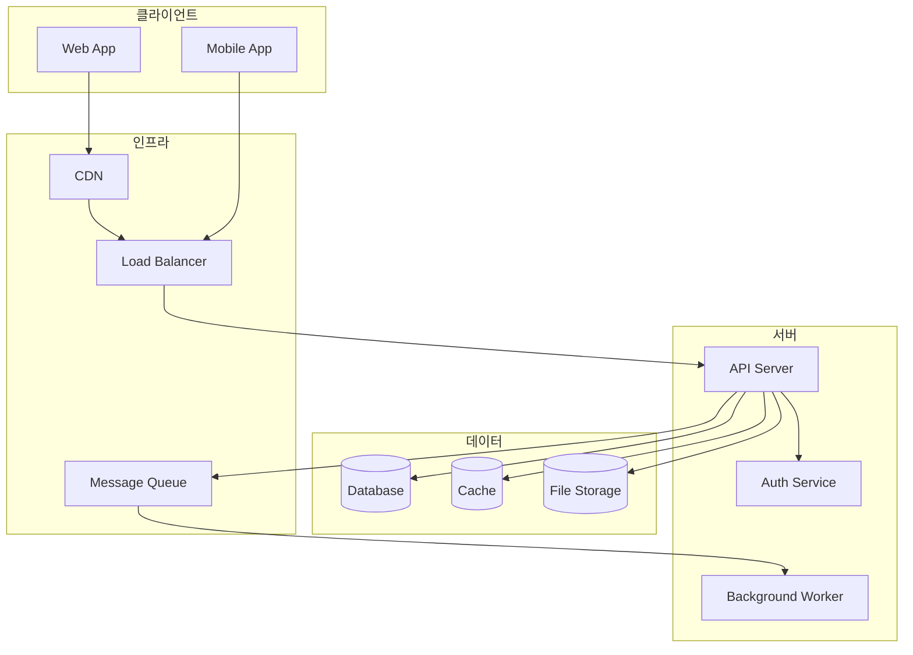
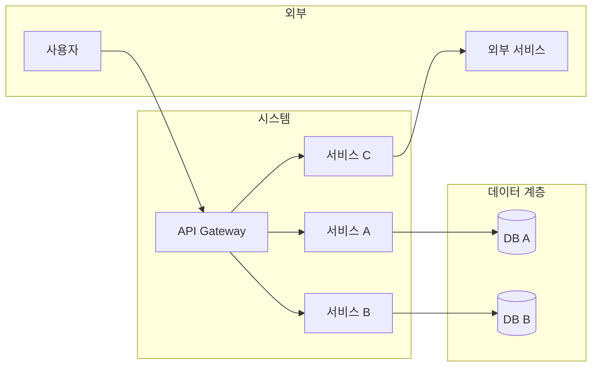
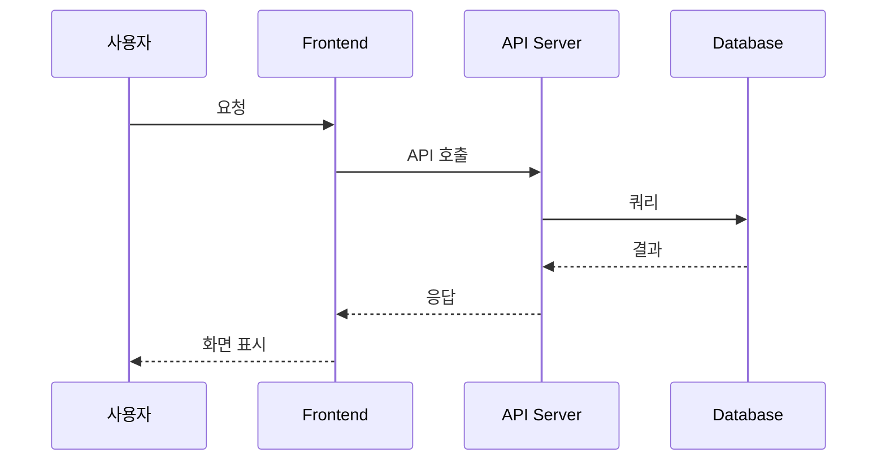
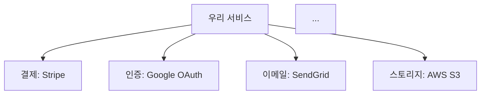
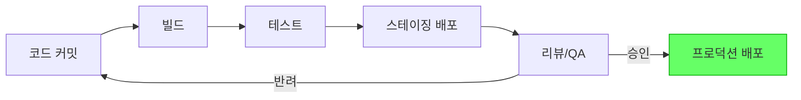

# Variables
- $$requirements = plan_requirement_analyzer의 결과 (서비스 개요 + FR/NFR 목록)
- $$screens = plan_screen_designer의 결과 (화면 설계)
- $$depth = 기획 깊이 (light / standard / deep)

# Rules
- $$variable 형식으로 변수 참조
- 각 Step 완료후 다음 Step 진행 전 결과를 명시적으로 서술.
- $$depth에 따라 산출물의 상세 수준을 조절한다.
  - light: 기술 스택 추천 위주, 아키텍처 개요도 1개
  - standard: 기술 스택 비교 + 아키텍처 설계 + 외부 서비스 목록
  - deep: 심층 기술 비교 + 상세 아키텍처 + 인프라 구성 + 비용 추정

## Errors/Exception Handling
- 선행 결과 부족 → 부모 Context에 보고, 보완 요청
- 기술 조사 중 정보 부족 → 확인된 범위까지만 작성, 미확인 항목 명시

---
# Action

## Step 1. 기술 요구사항 분석
$$requirements의 FR/NFR과 $$screens를 분석하여 기술적 요구사항을 도출한다:
- **플랫폼**: Web / Mobile(Native/Hybrid) / Desktop / 복합
- **실시간 요구**: 실시간 통신 필요 여부 (채팅, 알림, 실시간 동기화 등)
- **데이터 특성**: 데이터 양, 구조(정형/비정형), 읽기/쓰기 비율
- **인증/보안**: 인증 방식, 보안 수준
- **트래픽 예상**: 동시접속자, 피크 트래픽 예측
- **특수 기술**: AI/ML, 지도, 결제, 미디어 처리 등

## Step 2. 기술 스택 제안
요구사항에 적합한 기술 스택을 제안한다.

### 비교 영역
각 영역별로 2~3개 후보를 비교한다:

```
[TS-{번호}] {영역}: {추천 기술}
- 후보: {후보 1} vs {후보 2} vs {후보 3}
- 추천: {추천 기술}
- 추천 근거: {왜 이 기술이 적합한지}
- 고려사항: {도입 시 주의할 점}
```

### 영역 목록
- **Frontend**: 프레임워크, 상태관리, UI 라이브러리
- **Backend**: 언어, 프레임워크, API 방식 (REST/GraphQL)
- **Database**: RDBMS, NoSQL, 캐시
- **Infrastructure**: 클라우드, 컨테이너, CI/CD
- **Authentication**: 인증 방식, OAuth 제공자
- **Storage**: 파일/미디어 저장소
- **Monitoring**: 로깅, 모니터링, APM

### 기술 스택 구성도
전체 기술 스택을 Mermaid flowchart로 시각화한다:


## Step 3. 시스템 아키텍처 설계
서비스 전체 아키텍처를 설계한다.

### 아키텍처 패턴 선정
- 모놀리식 / 마이크로서비스 / 모듈러 모놀리스 중 적합한 패턴 추천
- 선정 근거 (팀 규모, 서비스 복잡도, 확장성 요구 등)

### 아키텍처 다이어그램

> 서비스 특성에 맞게 구성요소를 추가/변형한다.

### 데이터 흐름도
주요 기능의 데이터 흐름을 Mermaid sequence diagram으로 표현한다:


## Step 4. 외부 서비스/API 조사
구현에 필요한 외부 서비스 및 API를 조사한다.

### 출력 형식
```
[EXT-{번호}] {서비스명}
- 용도: {어떤 기능에 사용되는지}
- 관련 기능: FR-{번호}
- 제공사: {서비스 제공 회사}
- 가격: {무료 / 유료 - 요금 체계}
- API 문서: {URL}
- 대안: {대체 가능한 서비스}
- 연동 난이도: 낮음 / 보통 / 높음
```

### 외부 서비스 의존 관계도


## Step 5. 인프라 및 배포 전략
> $$depth가 light인 경우 이 단계를 간소화 (클라우드 추천만)

- **클라우드 플랫폼**: AWS / GCP / Azure 추천 및 근거
- **배포 방식**: 컨테이너(Docker/K8s) / 서버리스 / PaaS
- **CI/CD 파이프라인**: 빌드 → 테스트 → 배포 흐름
- **환경 구성**: 개발 / 스테이징 / 프로덕션

### 배포 파이프라인 플로우차트


> $$depth가 deep인 경우, 월간 인프라 비용 추정치를 추가한다.

## Step 6. 기술 스펙 요약 및 검증
도출된 결과를 종합 정리한다:
- 기술 스택 요약 (영역별 추천 기술)
- 아키텍처 패턴 및 주요 구성요소
- 외부 서비스 수 및 예상 비용
- 기술적 리스크 목록
- NFR 충족 여부 검증

## Step 7. 부모 Context로 전달
아래 구조로 결과를 부모 Context에 반환한다:
```
## 기술 스펙 조사 결과

### 기술 요구사항
(분석 결과)

### 기술 스택
[TS-001] ...
[TS-002] ...
...
(기술 스택 구성도 flowchart)

### 시스템 아키텍처
- 아키텍처 패턴: ...
(아키텍처 다이어그램 flowchart)
(데이터 흐름 sequence diagram)

### 외부 서비스
[EXT-001] ...
[EXT-002] ...
...
(외부 서비스 의존 관계도 flowchart)

### 인프라 및 배포
- 클라우드: ...
- 배포 방식: ...
(배포 파이프라인 flowchart)

### 요약
- 기술 스택: N개 영역
- 외부 서비스: N개
- 기술적 리스크: N개
- NFR 충족: N/N
```
