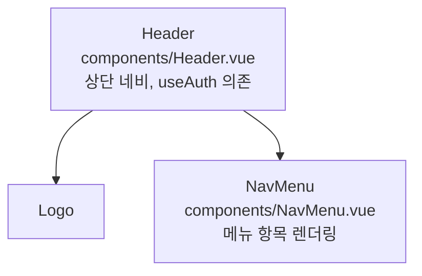

# 시각화 공통 규칙

문서, 노트, 분석 결과 등 이해 보강이 필요한 산출물을 생성할 때 출력 모드에 맞춰 다이어그램을 적극 활용한다.

## 적용 컨텍스트
- 학습 노트, 기술 문서, 가이드, 기획 산출물, 분석 결과, 시나리오 문서 등 **구조·흐름·관계·분포**가 포함되는 산출물
- $$output_mode 변수를 사용하는 SKILL의 결과물
- subagent가 부모 Context로 반환하는 마크다운 산출물

## 스킵 컨텍스트
- 단순 코드 답변, 일회성 대화 응답
- 메타 관리 작업 (prompt 관리, git 작업, 스킬 목록 출력 등)
- 데이터 변환·생성 등 시각화 가치가 없는 작업 (mock 데이터 생성 등)

## 규칙

### console 출력 시
- **ASCII 다이어그램 적극 사용**
- 코드블록(` ```text ` 또는 ` ``` `) 안에 작성, 너비 80자 이내 권장
- 활용 형식 풀:
  - 박스 다이어그램 (`┌─┐ │ │ └─┘`, `+--+`)
  - 플로우 화살표 (`→`, `─▶`, `▼`, `↓`)
  - 트리 구조 (`├─`, `└─`, `│  `)
  - 스코어 바 (`●●●○○`, `[████░░]`)
  - 매트릭스/표 (관점 × 이해도 등)
  - 와이어프레임 + 외부 라벨링 (박스 내부=식별자, 박스 외부=`◀──` 화살표로 경로·역할 주석 부착)
- 예: 관점별 이해도 바, 개념 관계 트리, 라운드 흐름 화살표, 구조 박스, 컴포넌트/모듈 와이어프레임

### file / notion 출력 시
- **ASCII 다이어그램 중심** — file·notion 출력이라도 구조·관계·흐름·트리·토폴로지·와이어프레임은 ASCII 다이어그램으로 작성한다.
  - ASCII 다이어그램은 반드시 코드블록(` ```text `) 안에 작성한다 — Notion·뷰어의 monospace 정렬을 보존하기 위함.
  - Notion은 코드블록 ASCII와 mermaid를 모두 자동 렌더링한다.
- **mermaid는 아래 3종에만 사용한다:**
  | 형식 | 용도 |
  |---|---|
  | `sequenceDiagram` | 시간 흐름·왕복 통신 (ASCII 표현이 비효율적) |
  | PREREQUISITES (`flowchart`) | STUDY 템플릿 선행지식 의존 그래프 |
  | 추천후속학습 (`flowchart`) | STUDY 템플릿 후속학습 의존 그래프 |
- 위 3종을 제외한 모든 다이어그램은 출력 모드와 무관하게 ASCII로 작성한다.
- mermaid flowchart(PREREQUISITES·추천후속학습) 작성 시 노드/엣지 문법은 해당 SKILL이 참조하는 flowchart 템플릿($$flowchart_page 등) 지시를 따른다.

### ASCII 다이어그램 작성 위생 (console·file·notion 공통)
- 박스 내부 텍스트와 화살표 라벨에는 ASCII 문자(영문·숫자·기호)만 사용한다.
  - 한글(CJK)은 monospace에서 2-cell 폭을 차지해 박스 변·정렬을 깨뜨린다.
- 한글 설명이 불가피하면 박스/다이어그램 '밖'(하단 캡션 줄)에 배치한다.
- 화살표 라벨도 ASCII만 사용 — 한글 라벨은 폭을 밀어 정렬을 깬다.
- 박스가 깨지지 않도록 정렬 보존을 최우선으로 한다.

### 와이어프레임 + 외부 라벨링 패턴
컴포넌트·모듈·API 등 식별자가 있는 구성 요소를 시각화할 때 사용한다.

- **박스 내부**: 식별자만 기재 (컴포넌트명, 함수명, 엔드포인트 경로 등)
- **박스 외부**: `◀──` 화살표로 `[경로]` + 역할 주석 부착
- 중첩 구성 요소는 들여쓰기로 표현하고, 각 요소마다 외부 라벨을 붙일 수 있다.

console (ASCII) 예시:
```
┌─────────────┐ ◀── [components/Header.vue]
│ Header      │      역할: 상단 네비게이션, useAuth() 의존
│  ─ Logo     │
│  ─ NavMenu  │ ◀── [components/NavMenu.vue]
└─────────────┘      역할: 메뉴 항목 렌더링
```

file / notion — 와이어프레임도 ASCII 중심 원칙을 따른다(위 console ASCII 예시를 그대로 사용). 박스 내부는 ASCII 식별자만, 한글 역할 주석은 박스 밖에 배치한다. mermaid가 굳이 필요한 경우의 대체 형태:


### 공통 원칙
- 다이어그램은 텍스트 설명을 **대체하지 않고 보강**한다.
- 한 산출물당 **여러 형식의 다이어그램을 교차 활용**한다 (구조 + 흐름 + 분포 등).
- 같은 개념을 **다른 관점의 다이어그램으로 중복 시각화**하면 이해도가 깊어진다.
  (예: 시퀀스 + 누적 구조 + Before/After 비교)
- 노드 라벨에 콜론(`:`)·괄호(`()`)·이모지 사용 시 escape 또는 회피한다.
- 독자/학습자 수준($$level 등)에 맞춰 복잡도를 조절한다.
- 다이어그램 위/아래에 **간단한 캡션**을 붙여 무엇을 보여주는지 명시한다.

## 예외
- SKILL.md 또는 agent 정의에 별도 시각화 정책이 명시된 경우, 해당 정책이 우선한다.
- 산출물 길이·맥락상 다이어그램이 오히려 노이즈가 되는 경우(짧은 단일 사실 응답 등) 생략 가능하다.
