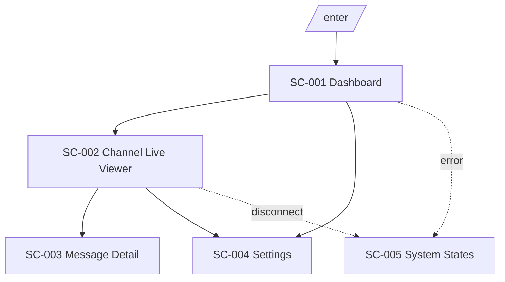
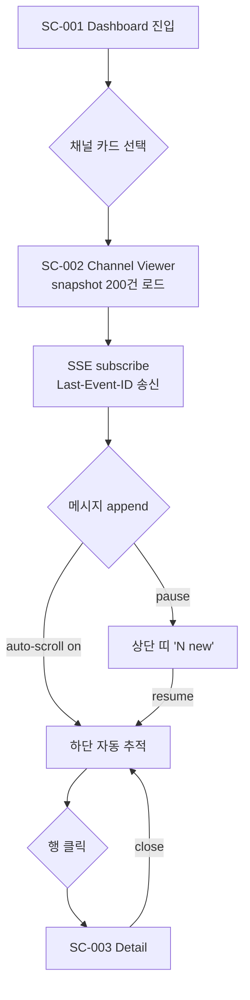
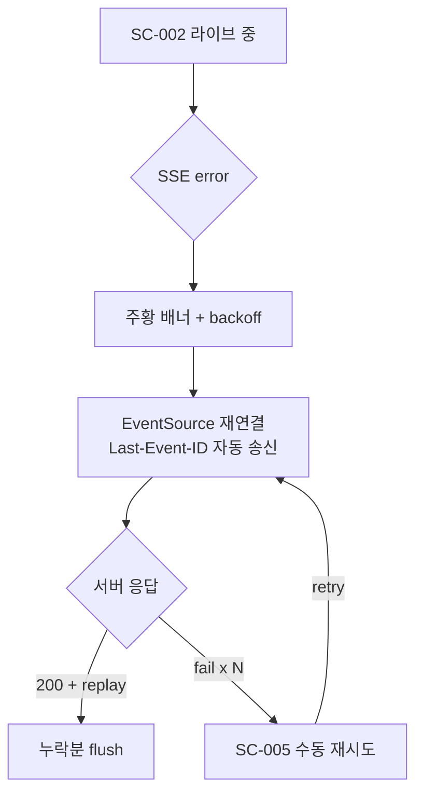
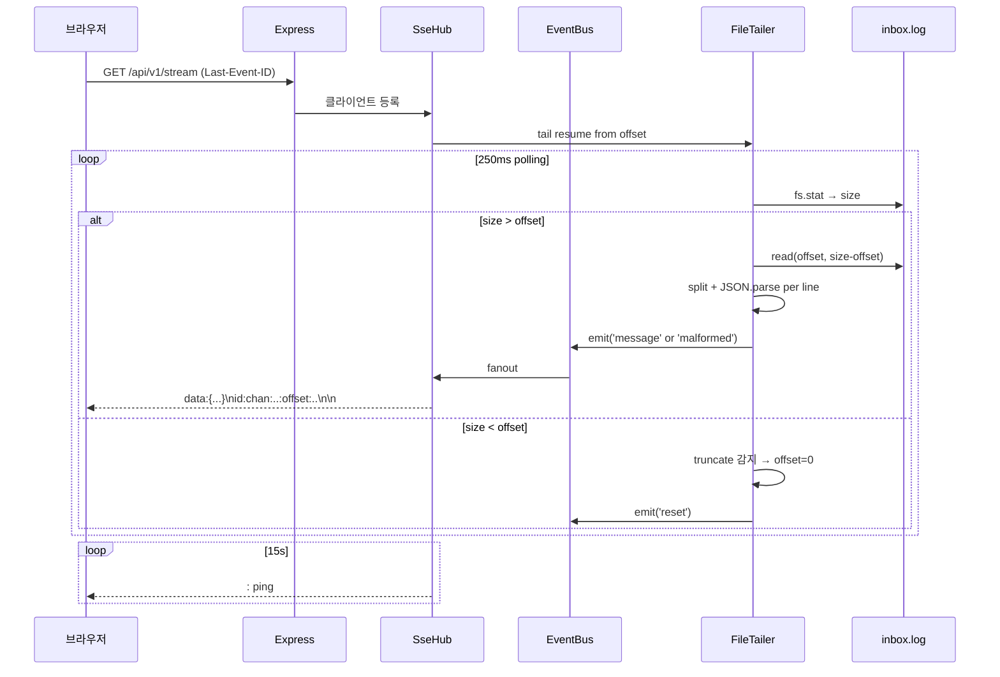
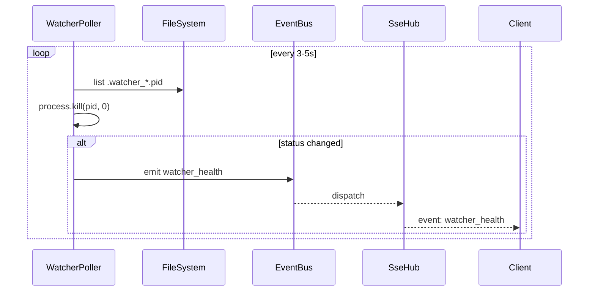

# ipc-monitor-web — 기획서

> skill_ipc_control 런타임(채널·메시지·watcher)을 실시간 가시화하는 **읽기 전용 웹 모니터링 인터페이스** 기획 산출물.

- 생성일: 2026-05-20
- 출처 스킬: `skill_plan` (depth=standard, exclude=2·3·4·6)
- 파이프라인: `plan_requirement_analyzer` → `plan_interface_designer` → `plan_tech_researcher`

---

## 0. 요구사항 확인서

| 항목 | 값 |
|---|---|
| 서비스명(가칭) | ipc-monitor-web |
| 목적 | 파일 기반 IPC 런타임의 채널·메시지·watcher 상태를 실시간 가시화 |
| 대상 사용자 | 멀티 Claude Code 세션 운영자(본인 + 동일 패턴 채택 개발자) |
| 범위 | 읽기 전용. 대시보드 + 채널별 라이브 뷰어. SSE 푸시. MALFORMED 가시화 |
| 제외 범위 | send / watcher start·stop 제어, 인증, 알림, 아카이브, 사용자 분류, DB |
| 서버 | Node.js 18+ + Express 5 |
| 클라이언트 | **Vanilla JS (ES module, 빌드 없음, 의존 0)** |
| 실시간 | SSE (단일 endpoint × 9 event type, Last-Event-ID 재동기화) |
| 데이터 | 파일 시스템 직접 tail (channels/<channel>/inbox.log, .read_<as>, .watcher_<as>.pid) |
| 플랫폼 | Windows 10/11, 127.0.0.1 바인딩 |
| 진입점 | `skill_ipc_control/tools/web_monitor/` + `.cmd` 진입점 (methods/와 분리) |
| 자산 배치 | `public/` 디렉토리를 Express가 static serve |

### MVP 슬라이스 (확정)
- **포함 5개**: FR-001 채널 목록 / FR-004 라이브 스트림 / FR-009 SSE 푸시 / FR-010 tail 워커 / FR-018 config
- **보류**: FR-002 watcher 헬스, FR-005 MALFORMED 가시화, FR-011 watcher 폴링 등 → v2
- **이유**: send.ps1이 이미 `FileShare.Read` 보장 (검증 완료) → 잠금 리스크 해소, "보이는 것 우선" 슬라이스

---

## 1. 기능 요구사항 (FR)

총 18개 / Core 11 · Support 4 · Management 3

### Core - 대시보드
- **FR-001** 채널 목록: `channels/` 디렉토리 스캔, 채널별 총 메시지/마지막 ts/watcher 개수 (Must)
- **FR-002** Watcher 헬스: `.watcher_<as>.pid` → alive/dead/stale 배지 (Must)
- **FR-003** 세션별 읽기 진행률: `.read_<as>` vs inbox 총 라인 (Should)

### Core - 채널 라이브 뷰어
- **FR-004** 메시지 라이브 스트림: snapshot + append (Must)
- **FR-005** MALFORMED_LINE 가시화: raw + 파싱 에러 사유 (Must)
- **FR-006** 필터링/검색: from/to/본문/시간/타입 (Should)
- **FR-007** broadcast/그룹 라우팅 배지 (→all, →a,b) (Should)
- **FR-008** 메시지 상세 펼침 + 복사 (Should)

### Core - 실시간 전송
- **FR-009** SSE 푸시 + 자동 재연결 + Last-Event-ID 재동기화 (Must)
- **FR-010** 서버 사이드 파일 tail 워커 (오프셋 기반) (Must)
- **FR-011** Watcher 헬스 폴링 (3~5초, 변화 시에만 emit) (Must)

### Support
- **FR-012** auto-scroll/pause 토글 (Should)
- **FR-013** 메타/rate 미니차트 (Could)
- **FR-014** 다크/라이트 테마 (Could)
- **FR-015** localStorage 설정 영속화 (Could)

### Management
- **FR-016** /healthz, /metrics (Should)
- **FR-017** 서버 로그 (Should)
- **FR-018** skill_ipc_control 루트 경로 config (Must)

---

## 2. 비기능 요구사항 (NFR)

| ID | 영역 | 요건 | 우선순위 |
|---|---|---|---|
| NFR-001 | Performance | 푸시 지연 평균 ≤ 500ms, P95 ≤ 1.5s | Must |
| NFR-002 | Scalability | 동시 채널 ≥ 20, 채널당 100MB inbox.log에서 RSS < 300MB | Should |
| NFR-003 | Security | 기본 127.0.0.1 바인딩, 외부 노출 시 토큰 옵션 | Must |
| NFR-004 | Security | 읽기 전용 보장 (write API 미존재) | Must |
| NFR-005 | Stability | Windows FileStream lock 회피 (FileShare.ReadWrite) | Must |
| NFR-006 | Stability | 손상 JSON 라인 무중단 (MalformedEvent 변환) | Must |
| NFR-007 | Availability | SSE 끊김 시 Last-Event-ID로 무손실 재동기화 | Must |
| NFR-008 | Compatibility | Node 18+, Windows 10/11 무설정 구동 | Must |
| NFR-009 | Compatibility | 최신 Chrome/Edge/Firefox 최근 2개 메이저 | Should |
| NFR-010 | Maintainability | 모듈 분리, 핵심 로직 단위 테스트 ≥ 70% | Should |

**MoSCoW 분포**: Must 15 / Should 10 / Could 3

---

## 3. 화면 설계

### SC-001 Dashboard (홈)
- URL: `/`
- 구성: 헤더(네비·SSE 상태·테마 토글) / 메타 패널(총 채널·메시지·MALFORMED 비율·rate) / Channels 카드 그리드 / Watchers 패널 / Sessions read 패널
- 상태: 로딩(skeleton), 빈("config 경로 확인"), 에러(retry)

```
┌──────────────────────────────────────────────────────────────┐
│ IPC Monitor    [Channels] [Watchers] [Settings]   ☾  ●live   │
├──────────────────────────────────────────────────────────────┤
│ Meta:  channels 7  msgs 12,438  malformed 0.12%  rate 4.3/s  │
├──────────────────────────────────────────────────────────────┤
│ ┌── Channels ───────────────────────────────────────────────┐│
│ │ # plan-loop      msgs 842   last 12s   watchers 2/2  ▶    ││
│ │ # build-loop     msgs 311   last 1m    watchers 1/2 ⚠    ││
│ │ # debug          msgs   4   last 1h    watchers 0/1 ✕    ││
│ └───────────────────────────────────────────────────────────┘│
│ ┌── Watchers ──────────┐ ┌── Sessions read progress ───────┐│
│ │ as=a pid 1234 alive  │ │ a  ▓▓▓▓▓▓▓▓░░  812/842          ││
│ │ as=b pid 9912 stale  │ │ b  ▓▓▓▓░░░░░░  400/842          ││
│ │ as=c  ---   dead     │ │                                 ││
│ └──────────────────────┘ └─────────────────────────────────┘│
└──────────────────────────────────────────────────────────────┘
```

### SC-002 Channel Live Viewer
- URL: `/channels/:name?from=&to=&q=&msg=`
- 구성: 헤더(채널명·watcher 카운트·live·pause·export) / 좌측 Filter+Meta / 본문 가상 스크롤 Stream
- 배지: `→all`(보라) / `→a,b`(group, 청록) / `→a`(direct, 회색) / `MALFORMED`(적색)
- 인터랙션: 행 클릭 → SC-003 슬라이드, pause 시 "N new" 띠, 상단 도달 → 과거 lazy load, 필터는 URL 쿼리 + localStorage 영속화

```
┌──────────────────────────────────────────────────────────────┐
│ ◀ Back   # plan-loop    watchers 2/2  ●live  [⏸ pause] [↧]  │
├───────────────────────┬──────────────────────────────────────┤
│ Filters               │ Stream                               │
│  from [a▾] to [all▾]  │ 14:02:11 a →all   "snapshot ok"     │
│  type  [msg|malf|all] │ 14:02:09 b →a     "ack 42"          │
│  text  [_________]    │ 14:02:07 ⚠ MALFORMED  raw:{id:..    │
│  time  last 15m ▾     │ 14:02:05 a →a,b   "broadcast..."[2] │
│  [Apply] [Reset]      │ 14:02:01 c →a     "hello"           │
│                       │ ─── auto-scroll ─── ▼               │
│ Meta                  │                                      │
│  msgs 842             │                                      │
│  malformed 1 (0.1%)   │                                      │
│  rate ▁▂▅▇▅▂▁         │                                      │
└───────────────────────┴──────────────────────────────────────┘
```

### SC-003 Message Detail (Slide-over)
- 트리거: SC-002 행 클릭 (URL: `?msg=<id>`)
- 표시: id·ts·from·to(+toKind)·size·body (코드 블록) · 복사 버튼
- MALFORMED 변형: `raw` 원문 + `error` + line offset

### SC-004 Settings
- root path(readonly) / poll interval / default time window / theme / "Reset local settings"

### SC-005 System States
- 404, SSE 영구 실패(수동 재시도), 채널 없음, root path 미설정

### Site Map



---

## 4. User Flow

### UF-001 라이브 관찰


### UF-002 재연결


### UF-003 Watcher 이상 감지
- SC-001 진입 → `watcher_health` 이벤트로 상태 변화 감지 → 배지 색 전환 + 토스트 → 해당 채널로 이동

### UF-004 손상 라인 조사
- SC-002에서 MALFORMED 배지 발견 → SC-003에서 raw + error + line offset 확인 → 원본 로그 위치 추적

---

## 5. API 설계

### 5.1 REST (read-only, `/api/v1/*`)

| Method | Path | 설명 | Query |
|---|---|---|---|
| GET | `/healthz` | liveness | — |
| GET | `/metrics` | prom-style 카운터 | — |
| GET | `/api/v1/config` | root path, poll interval 등 | — |
| GET | `/api/v1/channels` | 채널 요약 목록 | — |
| GET | `/api/v1/channels/:name` | 채널 상세 | — |
| GET | `/api/v1/channels/:name/messages` | 메시지 페이지네이션 | `before`, `after`, `limit≤500`, `from`, `to`, `type`, `q`, `since`, `until` |
| GET | `/api/v1/channels/:name/messages/:id` | 단건 조회 | — |
| GET | `/api/v1/watchers` | 전체 watcher 헬스 | — |
| GET | `/api/v1/sessions/:channel` | as별 read progress | — |

응답 예시 — `GET /api/v1/channels`:
```json
{
  "channels": [
    {
      "name": "plan-loop",
      "total": 842,
      "lastTs": "2026-05-20T14:02:11.823Z",
      "lastId": "0193a4f1-...",
      "watchers": { "alive": 2, "stale": 0, "dead": 0, "total": 2 },
      "malformedCount": 1
    }
  ]
}
```

### 5.2 SSE — 단일 endpoint × event type 멀티플렉싱

> **설계 보정**: 브라우저 EventSource는 origin당 동시 연결 6개 한도. 채널별 + 시스템 토픽을 각각 endpoint로 분리하면 한도를 빠르게 소모하므로 **단일 endpoint + `event:` 필드로 멀티플렉싱**.

- 엔드포인트: `GET /api/v1/stream?channels=plan-loop,build-loop&topics=watcher,session`
- 헤더: `Content-Type: text/event-stream`, `Cache-Control: no-cache, no-transform`, `X-Accel-Buffering: no`
- 재연결: `Last-Event-ID` 헤더(브라우저 자동) → 서버는 각 채널 토픽의 마지막 offset 기준 replay

| event | 설명 | data |
|---|---|---|
| `snapshot_begin` | 스트림 시작 메타 | `{ channel, total, headOffset, serverTs }` |
| `message` | 신규 메시지 | `{ channel, id, ts, from, to, toKind, body, size, offset }` |
| `malformed` | 손상 라인 | `{ channel, lineNo, raw, error, ts, offset }` |
| `watcher_health` | watcher 상태 변경 | `{ channel, as, pid, status, lastSeen }` |
| `session_progress` | read 진행률 변경 | `{ channel, as, readCount, total, ratio }` |
| `rate_tick` | rate 갱신(1s) | `{ channel, msgPerSec, malformedPerSec }` |
| `heartbeat` | keepalive (15s) | `{ serverTs }` |
| `error` | 비치명 에러 | `{ code, message }` |
| `bye` | 서버 종료 | `{ reason }` |

`id:` 필드 포맷: `chan:<name>:offset:<n>` 또는 `sys:<seq>` — 클라이언트는 이를 그대로 Last-Event-ID로 송신, 서버는 채널별 offset map으로 분해 후 resume.

---

## 6. 데이터 모델 (서버 내부)

```ts
type Channel = {
  name: string;
  inboxPath: string;
  total: number;
  lastId?: string;
  lastTs?: string;
  headOffset: number;
  malformedCount: number;
  watchers: Map<string, Watcher>;
  sessions: Map<string, SessionRead>;
};

type Watcher = {
  channel: string; as: string; pidPath: string;
  pid: number | null;
  status: "alive" | "stale" | "dead";
  lastSeen: string; mtime: string;
};

type SessionRead = {
  channel: string; as: string; readPath: string;
  readCount: number; total: number; ratio: number;
};

type MessageEvent = {
  kind: "msg"; channel: string; offset: number;
  id: string; ts: string; from: string; to: string;
  toKind: "single" | "all" | "group";
  body: unknown; size: number;
};

type MalformedEvent = {
  kind: "malformed"; channel: string; offset: number;
  lineNo: number; raw: string; error: string;
};

type WatcherHealthEvent = {
  kind: "watcher_health"; channel: string; as: string;
  pid: number | null; status: "alive" | "stale" | "dead";
  lastSeen: string;
};

type RateTick = {
  kind: "rate_tick"; channel: string;
  msgPerSec: number; malformedPerSec: number; windowMs: 1000;
};
```

### 내부 컴포넌트

| 컴포넌트 | 책임 |
|---|---|
| FileTailer | 채널별 1개. 폴링 + `fs.open('r')` + read at offset, truncate 감지, Windows 친화 |
| JsonLineParser | 라인별 try/parse, 실패 시 MalformedEvent |
| WatcherPoller | 3~5s 주기, `process.kill(pid, 0)` 기반 PID liveness |
| SessionWatcher | `.read_<as>` mtime 변화 시 라인 수 재계산 |
| EventBus | Node EventEmitter, 토픽 = `channel:<name>` / `system` |
| SseHub | 구독자별 ring buffer 백프레셔, 초과 시 oldest drop |

---

## 7. 시스템 흐름

### 7.1 메시지 라이브 전파



### 7.2 재연결
- 브라우저가 `EventSource` reconnect 시 Last-Event-ID 자동 송신 → 서버가 채널별 offset map으로 분해 → FileTailer resume → 누락분 replay → live tail 합류

### 7.3 Watcher 헬스


---

## 8. 기술 스택

### 백엔드
| 영역 | 선정 | 근거 |
|---|---|---|
| HTTP | Express 5 | async error 자동 처리, 미들웨어 생태계 |
| 보안 헤더 | helmet | CSP·X-Frame-Options 일괄, SSE 라우트만 별도 정책 |
| 로깅 | pino + pino-http | JSON, winston 대비 5~10× 빠름 |
| 파일 tail | **커스텀 폴링** (chokidar/fs.watch 미사용) | Windows ReadDirectoryChangesW 누락·FileStream lock 충돌 회피, offset 직접 관리 |
| JSONL 파싱 | 직접 try/parse (+ split2 보조) | 손상 라인을 MalformedEvent로 보존 필요 |
| SSE | 직접 SseHub | id=offset 모델이 라이브러리 히스토리 버퍼와 충돌 |
| PID liveness | `process.kill(pid, 0)` | 내장, 0~1ms, ESRCH/EPERM 구분 |
| 설정 | dotenv + zod | 환경값 타입 검증 |
| 테스트 | vitest | ESM 네이티브, Windows 호환 |

### 프런트엔드 (의존 0 — 회의 확정)
| 영역 | 선정 | 근거 |
|---|---|---|
| 프레임워크 | **없음. Vanilla JS (ES module)** | 빌드 파이프라인 제거, `<script type="module">`로 즉시 구동. skill 발동 시 라이트 부팅 요건 |
| 가상 스크롤 | **직접 구현** (top spacer + visible window + bottom spacer) | 메시지 행이 비교적 균일 → 단순 fixed-height 가상화로 100~200줄로 구현 가능 |
| Sparkline | **직접 SVG path** | 50줄 미만. mini 차트만 필요 |
| 스타일 | CSS Variables | `:root[data-theme="dark"]` 토글 최단경로 |
| 모듈 로딩 | 브라우저 네이티브 ESM (`import`/`export`) | Node 측 `type: "module"`와 짝, 번들러 없음 |
| 패키지 매니저 | npm (server 측만) | 의존 0이므로 디스크 압박 무관 |

### 디렉토리 구조 (회의 확정 — `tools/web_monitor/`로 메서드와 분리)

```
skill_ipc_control/
├── methods/                          ← 기존 IPC 통신 메서드 (a~e)
└── tools/
    └── web_monitor/                  ← 본 프로젝트
        ├── README.md
        ├── monitor_start.cmd         ← Windows 진입점 (start server)
        ├── monitor_stop.cmd          ← stop (PID 기반)
        ├── package.json              ← server 의존성만
        ├── .env.example
        ├── server/
        │   ├── index.mjs             ← Express bootstrap (127.0.0.1)
        │   ├── config.mjs            ← zod 검증
        │   ├── log.mjs               ← pino
        │   ├── core/
        │   │   ├── event-bus.mjs
        │   │   ├── sse-hub.mjs
        │   │   ├── file-tailer.mjs
        │   │   ├── json-line-parser.mjs
        │   │   ├── watcher-poller.mjs       ← v2
        │   │   └── session-watcher.mjs      ← v2
        │   └── routes/
        │       ├── channels.mjs
        │       └── stream.mjs
        └── public/                   ← Express express.static('public')
            ├── index.html
            ├── app.js                ← ES module entrypoint
            ├── style.css             ← CSS variables
            └── lib/
                ├── sse.js            ← EventSource wrapper
                ├── virtual-list.js   ← 직접 구현 가상 스크롤
                └── sparkline.js      ← 직접 SVG sparkline
```

### npm scripts (server 측만)
```json
{
  "type": "module",
  "scripts": {
    "start": "node server/index.mjs",
    "dev": "node --watch server/index.mjs",
    "test": "vitest run"
  }
}
```

### `.cmd` 진입점 (기존 IPC 스킨과 일관)
- `monitor_start.cmd <port?>` — Node 서버 기동 + PID 파일 기록
- `monitor_stop.cmd` — PID 파일 기반 종료
- 자동승인: `~/.claude/skills/skill_ipc_control/tools/web_monitor/monitor_start.cmd` prefix를 settings.json `permissions.allow`에 등록

---

## 9. 외부 의존 / 제약

| 항목 | 내용 |
|---|---|
| Windows process | `process.kill(pid, 0)` (errno 기반). 보조 검증: `tasklist /FI "PID eq <pid>"` |
| fs.watch 한계 | Windows ReadDirectoryChangesW 기반 → append-only 이벤트 누락. **사용 안 함**, stat 폴링으로 대체 |
| EventSource | 브라우저 내장, Last-Event-ID 자동 송신, origin당 최대 6 동시 연결 |
| skill_ipc_control | 동일 머신의 channels/ 경로 read 권한 필요. send.ps1이 inbox.log를 `FileShare.Read`로 여는지 검증 필수 |

---

## 10. 리스크

| # | 리스크 | 완화책 |
|---|---|---|
| R1 | 100MB inbox.log 첫 진입 시 full load | snapshot 미전송, 현재 offset부터 stream, 과거는 REST lazy load |
| R2 | SSE keepalive 단절 | 15s `: ping`, 자동 재연결 |
| R3 | 파일 truncate/rotate | `stat.size < lastOffset` 감지 → offset=0 + `reset` 이벤트 |
| R4 | 손상 JSON | per-line try/parse, partial line 버퍼 보관 |
| R5 | Windows FileStream lock | fs.open `'r'`, send.ps1 측 `FileShare.Read` 보장 전제. 실패 시 100ms backoff × 3 |
| R6 | 채널 20개 폴링 CPU | 활성 250ms / idle 1s 분리, stagger 분산 |
| R7 | SseHub 백프레셔 | 채널별 ring buffer 1000건 상한, 초과 oldest drop + `dropped` 이벤트 |
| R8 | 브라우저 6 connection 한도 | **단일 SSE endpoint + event type 멀티플렉싱** (위 5.2 반영) |

---

## 11. NFR 충족 검증

| NFR | 전략 | 판정 |
|---|---|---|
| P95 ≤ 1.5s | 250ms 폴링 + 즉시 fanout (평균 ~125ms) | 충족 |
| RSS < 300MB | snapshot 미전송, ring buffer, pino 경량, Vue 빌드 ≤50KB | 충족 |
| 127.0.0.1 | `app.listen(port, '127.0.0.1')` | 충족 |
| 읽기 전용 | fs.open `'r'`만 사용, write 라우트 없음 | 충족 |
| Windows 잠금 회피 | fs.watch 미사용, share read | 충족 (send.ps1 FileShare.Read 전제) |
| 손상 JSON 내성 | per-line try/parse + MalformedEvent | 충족 |
| Last-Event-ID 재동기화 | id=offset, FileTailer resume | 충족 |
| 가상 스크롤/sparkline/테마 | virtua + SVG + CSS vars | 충족 |

**8/8 충족.**

---

## 12. 후속 작업 (Next Skills)

| Skill | 입력 | 비고 |
|---|---|---|
| `skill_build` | 이 기획서 (`docs/plans/monitoring_ui.md`) | Node + Vue 모놀리스 scaffold 후 server/client 단계적 구현 |
| `skill_sampler` (선택) | 이 기획서 | UI 와이어프레임 기반 mock 화면 우선 제작 가능 |

### 즉시 확인 사항 (구현 착수 전) — 모두 해소됨 ✅
1. **send.ps1 `FileShare.Read` 검증 완료** — `send.ps1:58-63`에서 `[System.IO.FileShare]::Read` 명시 + 동시 writer share-violation 50회 retry까지 구현되어 있음. 모니터링 read 무충돌 보장
2. **MVP 범위 합의 완료** — 최소 5개 슬라이스 (FR-001/004/009/010/018) 우선, 나머지는 v2

### 회의 확정사항 (2026-05-20 Step 9 직전)
| 항목 | 확정값 |
|---|---|
| MVP 범위 | FR-001 채널 목록 / FR-004 라이브 스트림 / FR-009 SSE / FR-010 tail 워커 / FR-018 config |
| 클라이언트 스택 | Vanilla JS (ES module) — 빌드 도구 없음, 의존 0 |
| 가상 스크롤·sparkline | 직접 구현 |
| 진입점 | `skill_ipc_control/tools/web_monitor/` 디렉토리, `monitor_start.cmd` / `monitor_stop.cmd` |
| 자산 배치 | Express `express.static('public')`, HTML/JS/CSS 별도 파일 |
| 폐기된 후보 | Vue 3 + Vite / virtua / Tailwind / pnpm |

---

## 13. Step 진행 요약

| Step | 수행 | 산출물 |
|---|---|---|
| 0 | 요구사항 회의 | depth=standard, output=file, exclude=2/3/4/6 |
| 1 | 계획 수립 | requirement → interface → tech 직렬 파이프라인 |
| 2 | plan_requirement_analyzer | FR 18 / NFR 10 |
| 5 | plan_interface_designer | 화면 5 / Flow 4 / REST 9 / SSE 9 / 타입 7 / 컴포넌트 5 |
| 7 | plan_tech_researcher | 스택 13항 / 디렉토리 / 리스크 8 / SSE 단일 endpoint 보정 |
| 8 | 산출물 출력 | `docs/plans/monitoring_ui.md` (본 문서) |
