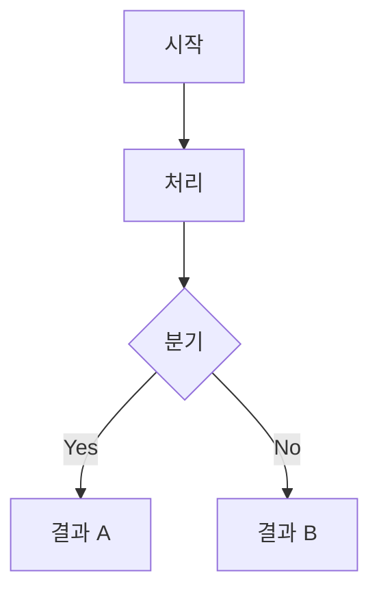

# Notion Enhanced Markdown 작성 스펙

Notion API의 `notion-create-pages` / `notion-update-page`에서 사용하는 Enhanced Markdown 문법 레퍼런스.
표준 Markdown을 확장하여 Notion 고유 블록(callout, toggle, color, table 등)을 지원한다.

---

## 1. 헤딩 색상 (Heading Color)

헤딩 뒤에 `{color="색상명"}` 을 붙여 배경색/텍스트색을 지정한다.

```markdown
# 섹션 제목 {color="green_bg"}
## 하위 섹션 {color="orange_bg"}
### 소제목 {color="blue_bg"}
```

### 사용 가능한 색상값
- 배경색: `green_bg`, `orange_bg`, `blue_bg`, `red_bg`, `pink_bg`, `yellow_bg`, `purple_bg`, `gray_bg`
- 텍스트색: `green`, `orange`, `blue`, `red`, `pink`, `yellow`, `purple`, `gray`

---

## 2. Callout 블록

`::: callout` ... `:::` 으로 감싸서 Callout 블록을 생성한다.
중첩(nested) Callout도 탭 들여쓰기로 지원된다.

```markdown
::: callout
	내용을 여기에 작성
:::
```

### 중첩 Callout

```markdown
::: callout
	## 외부 Callout 제목
	::: callout
		### 내부 Callout 제목
		내부 내용
	:::
	::: callout
		### 또 다른 내부 Callout
		내용
	:::
:::
```

### Callout + Toggle 조합

```markdown
::: callout
	## 토글 가능한 섹션 {toggle="true"}
		토글 내부 내용 (접힌 상태로 시작)
		### 하위 제목
		상세 내용
:::
```

> **핵심 패턴**: Callout 안의 헤딩에 `{toggle="true"}`를 붙이면 해당 Callout이 토글 블록이 된다.

---

## 3. Toggle 블록

Callout 내부 헤딩에 `{toggle="true"}` 속성을 추가하여 접기/펼치기 가능한 토글 블록을 생성한다.

```markdown
::: callout
	## 클릭하면 펼쳐지는 제목 {toggle="true"}
		숨겨진 내용이 여기에 표시됩니다.
		코드 블록, 리스트 등 모든 마크다운 요소 사용 가능.
:::
```

---

## 4. 테이블 (Table)

HTML `<table>` 태그를 사용하며, Notion 전용 속성을 지원한다.

```markdown
<table fit-page-width="true" header-row="true">
	<tr>
		<td>헤더 1</td>
		<td>헤더 2</td>
		<td>헤더 3</td>
	</tr>
	<tr>
		<td>값 1</td>
		<td>값 2</td>
		<td>값 3</td>
	</tr>
</table>
```

### 테이블 속성
- `fit-page-width="true"`: 페이지 너비에 맞춤
- `header-row="true"`: 첫 번째 행을 헤더로 지정

### 셀 내 서식
- `**굵게**`, `*이탤릭*` 등 인라인 마크다운 사용 가능
- `` `코드` `` 인라인 코드 사용 가능

---

## 5. Mermaid 다이어그램

` ```mermaid ` 코드 블록으로 다이어그램을 삽입한다.

```markdown

```

### 지원 다이어그램 유형
- `graph TD` / `graph LR`: 플로우차트 (상→하 / 좌→우)
- `sequenceDiagram`: 시퀀스 다이어그램
- `classDiagram`: 클래스 다이어그램
- `stateDiagram-v2`: 상태 다이어그램

### Mermaid 작성 팁
- 노드 라벨에 특수문자가 있으면 `["라벨"]` 형태로 감싸기
- subgraph로 그룹핑 가능: `subgraph "그룹명"` ... `end`
- HTML 태그 포함 시 `<br>` 줄바꿈 가능

---

## 6. 코드 블록

언어를 지정하여 구문 강조를 적용한다.

```markdown
```typescript
const hello: string = 'world';
```
```

### 지원 언어 (주요)
- `typescript`, `javascript`, `python`, `java`, `go`, `rust`
- `json`, `yaml`, `toml`, `xml`
- `bash`, `shell`, `sql`
- `plain text`: 구문 강조 없는 일반 텍스트

---

## 7. 수식 (Math)

LaTeX 수식을 `$$` 블록으로 삽입한다.

```markdown
$$
E = mc^2
$$
```

인라인 수식: `$E = mc^2$`

---

## 8. 빈 블록 (Empty Block)

섹션 사이에 여백을 추가할 때 사용한다.

```markdown
<empty-block/>
```

---

## 9. 텍스트 서식

### 인라인 서식
- `**굵게**`: 굵은 텍스트
- `*이탤릭*`: 이탤릭 텍스트
- `~~취소선~~`: 취소선
- `` `인라인 코드` ``: 인라인 코드
- `[링크 텍스트](URL)`: 하이퍼링크

### 인용구 (Quote)
```markdown
> 인용구 내용
```

---

## 10. 구분선 (Divider)

```markdown
---
```

---

## 11. 리스트

### 순서 없는 리스트
```markdown
- 항목 1
- 항목 2
	- 중첩 항목
```

### 순서 있는 리스트
```markdown
1. 첫 번째
2. 두 번째
	1. 중첩 순서
```

### 할 일 목록
```markdown
- [ ] 미완료
- [x] 완료
```

---

## 12. 실전 조합 패턴

### 패턴 A: 색상 헤딩 + Callout + Toggle (TEMPLATE: STUDY 스타일)

```markdown
# 개요 섹션 {color="green_bg"}
::: callout
	## Terminologies.
	::: callout
		**용어 1**: 설명
	:::
	::: callout
		**용어 2**: 설명
	:::
:::
::: callout
	## Structure & Core Components.
	```mermaid
graph LR
    A["컴포넌트 A"] --> B["컴포넌트 B"]
	```
	::: callout
		### Component 1. **이름** — 설명
		상세 내용
	:::
:::
<empty-block/>
---
# 다이어그램 섹션 {color="orange_bg"}
::: callout
	## Diagram 1. 전체 흐름
	### Flow
	```mermaid
sequenceDiagram
    participant A as Actor
    participant B as System
    A->>B: 요청
    B-->>A: 응답
	```
:::
<empty-block/>
---
# 시나리오 섹션 {color="blue_bg"}
::: callout
	## Scenario 1. 기본 시나리오 {toggle="true"}
		### Scenario
		시나리오 설명
		---
		### Solutions.
		1. 해결 과정
		2. 추가 설명
:::
<empty-block/>
---
# 주의사항 {color="red_bg"}
::: callout
	## 🚫 MustNOT 1. 금지 사항 {toggle="true"}
		### Situation
		상황 설명
		---
		### MustNot
		금지 사항 상세 설명
:::
::: callout
	## ⚠️ Warning 1. 경고 사항 {toggle="true"}
		### Situation
		상황 설명
		---
		### MustNot
		주의 사항 상세 설명
:::
<empty-block/>
---
# 예제 섹션 {color="pink_bg"}
::: callout
	## Ex 1. 기본 예제 {toggle="true"}
		### 발문
		```plain text
난이도: 기본
시나리오: 예제 시나리오 설명
		```
		---
		::: callout
			### Solution {toggle="true"}
				- 해결 방법 설명
				```typescript
// 코드 예제
const example = 'hello';
				```
		:::
:::
```

### 패턴 B: 비교 테이블 in Callout

```markdown
::: callout
	## 비교표
	<table fit-page-width="true" header-row="true">
		<tr>
			<td>구분</td>
			<td>**옵션 A**</td>
			<td>**옵션 B**</td>
		</tr>
		<tr>
			<td>특징</td>
			<td>값 A</td>
			<td>값 B</td>
		</tr>
	</table>
:::
```

### 패턴 C: 참조 섹션

```markdown
# References.
- `파일/경로/file.md`
- 공식 문서: [제목](URL)
- 소스코드: `패키지/경로/` 디렉토리
```

---

## 주의사항

1. **들여쓰기는 탭 문자**를 사용한다. Callout 중첩 레벨에 따라 탭 수가 증가한다.
2. **Callout 내부 코드 블록**의 들여쓰기는 코드 자체의 들여쓰기와 별도로 관리한다.
3. **특수문자 이스케이프**: 대괄호(`[`, `]`)는 Notion에서 링크로 해석될 수 있으므로, 리터럴로 사용 시 `\[`, `\]`로 이스케이프한다.
4. **Mermaid 노드 라벨**: `<`, `>` 등 특수문자가 포함되면 `["라벨"]` 큰따옴표로 감싸야 한다.
5. **<empty-block/>**: 섹션 구분 전에 삽입하여 시각적 여백을 확보한다. `---` 구분선과 함께 사용하는 것이 일반적이다.
