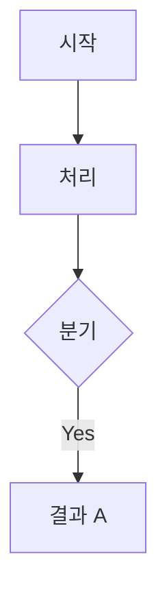

# Notion Enhanced Markdown 작성 스펙

Notion API의 `notion-create-pages` / `notion-update-page`에서 사용하는 Notion-flavored Markdown 문법 레퍼런스.
표준 Markdown을 확장하여 Notion 고유 블록(callout, toggle, color, table 등)을 지원한다.

> **권위 출처**: 본 문서는 요약본이다. 페이지 생성/수정 전 MCP 리소스 `notion://docs/enhanced-markdown-spec`(ReadMcpResourceTool, server=`claude_ai_Notion`)를 **권위 스펙으로 우선 확인**한다. 본 문서와 충돌 시 MCP 리소스가 우선한다.

> **들여쓰기는 탭 문자**를 사용한다. 자식 블록은 부모보다 한 단계 더 깊게 들여쓴다.

---

## 0. 이스케이프 (중요)

코드 블록 **밖**에서 아래 문자는 백슬래시로 이스케이프한다 (리터럴로 쓰고 싶을 때):

```
\ * ~ ` $ [ ] < > { } | ^
```

- 예: `\[` → `[`, `\*` → `*`
- **코드 블록(``` ``` ```) 안에서는 이스케이프 금지** — 내용은 리터럴 그대로 작성한다.

---

## 1. 헤딩 색상 (Heading Color)

헤딩(및 대부분 블록) 첫 줄에 `{color="색상명"}` 을 붙여 배경색/텍스트색을 지정한다.

```markdown
# 섹션 제목 {color="green_bg"}
## 하위 섹션 {color="orange_bg"}
### 소제목 {color="blue_bg"}
```

- 헤딩 5·6은 미지원 → 헤딩 4로 변환된다.

### 사용 가능한 색상값
- 배경색: `gray_bg`, `brown_bg`, `orange_bg`, `yellow_bg`, `green_bg`, `blue_bg`, `purple_bg`, `pink_bg`, `red_bg`
- 텍스트색: `gray`, `brown`, `orange`, `yellow`, `green`, `blue`, `purple`, `pink`, `red`

---

## 2. Callout 블록

**XML 태그** `<callout>...</callout>` 으로 생성한다. `icon`·`color` 속성은 선택.
callout은 인라인 리치 텍스트뿐 아니라 **여러 블록·중첩 자식**을 담을 수 있으며, 각 자식 블록은 한 단계 더 들여쓴다.

```markdown
<callout icon?="💡" color?="gray_bg">
	Rich text
	여러 블록·자식 가능
</callout>
```

### 중첩 Callout

```markdown
<callout>
	## 외부 Callout 제목
	<callout>
		### 내부 Callout 1
		내부 내용
	</callout>
	<callout>
		### 내부 Callout 2
		내용
	</callout>
</callout>
```

> callout 내부 서식은 HTML이 아니라 Notion-flavored Markdown을 쓴다 (예: 굵게는 `<strong>`이 아니라 `**`).

---

## 3. Toggle 블록 / Toggle 헤딩

두 가지 방식이 있다.

### (a) `<details>` 토글

```markdown
<details color?="Color">
<summary>클릭하면 펼쳐지는 제목</summary>
숨겨진 내용 (자식 블록)
</details>
```

### (b) Toggle 헤딩 — `{toggle="true"}`

```markdown
## 클릭하면 펼쳐지는 제목 {toggle="true" color?="Color"}
	숨겨진 내용 (반드시 한 단계 들여쓰기)
	### 하위 제목
	상세 내용
```

> **핵심**: toggle / toggle 헤딩의 자식은 **반드시 들여써야** 토글 안에 포함된다. 들여쓰지 않으면 토글 밖으로 빠진다.
> callout 안에서 toggle 헤딩을 쓰면, callout 자식(toggle 헤딩) → 그 자식(본문)으로 2단계 들여쓰기가 된다.

---

## 4. 테이블 (Table)

HTML `<table>` 태그를 사용한다. 모든 속성은 선택(기본 false).

```markdown
<table fit-page-width="true" header-row="true" header-column?="false">
	<colgroup>
		<col color?="Color">
		<col color?="Color">
	</colgroup>
	<tr color?="Color">
		<td>헤더 1</td>
		<td>헤더 2</td>
	</tr>
	<tr>
		<td>값 1</td>
		<td>값 2</td>
	</tr>
</table>
```

### 테이블 규칙
- `fit-page-width="true"`: 페이지 너비 맞춤 / `header-row="true"`: 첫 행 헤더 / `header-column="true"`: 첫 열 헤더
- `<colgroup>`/`<col>`: 열 색·너비 지정 (불필요하면 생략)
- 색 우선순위: 셀(`<td color>`) > 행(`<tr color>`) > 열(`<col color>`)
- **셀 내용은 리치 텍스트만** 가능 (헤딩·리스트·이미지 등 블록 불가)
- 셀 안 서식은 Notion-flavored Markdown 사용 (`**bold**`, `` `code` `` — `<strong>`/`<b>` 금지)
- 셀 병합은 이 포맷으로 불가 → 사용자가 Notion UI에서 직접 수행

---

## 5. Mermaid 다이어그램

` ```mermaid ` 코드 블록으로 삽입한다.

```markdown

```mermaid
graph TD
    A["시작"] --> B["처리"]
    B --> C{"분기"}
    C -->|"Yes"| D["결과 A"]
```
```

### Mermaid 작성 팁
- 노드 라벨에 특수문자(괄호 등) 포함 시 `["라벨"]` 큰따옴표로 감싸기
- 라벨 줄바꿈은 `<br>` (`\n` 금지)
- `\(` `\)` 금지 → 라벨 전체를 큰따옴표로 감싼다
- 코드 블록 안이므로 이스케이프하지 않는다

---

## 6. 코드 블록

언어를 지정하여 구문 강조를 적용한다. **내용은 이스케이프 없이 리터럴 그대로** 작성한다.

```markdown
```typescript
const arr = [1, 2, 3];
```
```

- 주요 언어: `typescript`, `javascript`, `python`, `java`, `go`, `rust`, `csharp`, `xml`, `json`, `yaml`, `bash`, `sql`, `mermaid`, `plain text`

---

## 7. 수식 (Math)

블록 수식:
```markdown
$$
E = mc^2
$$
```

인라인 수식은 백틱으로 감싼다: `` $`E = mc^2`$ ``

---

## 8. 빈 블록 (Empty Block)

```markdown
<empty-block/>
```
- 단독 라인에 작성해야 빈 줄로 렌더링된다.
- Notion이 블록 간 간격을 자동 처리하므로 남용하지 않는다.

---

## 9. 텍스트 서식 (Rich text)

- `**굵게**` / `*이탤릭*` / `~~취소선~~` / `` `인라인 코드` ``
- 밑줄: `<span underline="true">텍스트</span>`
- 인라인 색: `<span color="red">텍스트</span>` (텍스트색·배경색 모두)
- 링크: `[텍스트](URL)`
- 인용: `[^URL]`
- 멀티라인 인라인 코드·인용은 `<br>` 사용 (일반 newline 금지 — 블록이 쪼개짐)

### 인용구 (Quote)
```markdown
> 인용구 내용 {color?="Color"}
```
- 멀티라인은 `> 1줄<br>2줄` 형태 (줄마다 `>` 반복 금지 — 별개 블록으로 쪼개짐)
- 내용 없는 단독 `>` 금지 (빈 인용블록)

---

## 10. 구분선 (Divider) / 11. 리스트

```markdown
---
```

```markdown
- 항목 {color?="Color"}
	- 중첩 항목 (탭 들여쓰기)
1. 첫 번째
	1. 중첩 순서
- [ ] 미완료
- [x] 완료
```
- 리스트 항목은 인라인 리치 텍스트를 담아야 한다 (빈 항목 회피).

---

## 12. 실전 조합 패턴 (TEMPLATE: STUDY 스타일)

```markdown
# 개요 {color="green_bg"}
<callout>
	## Terminologies.
	<callout>
		**용어 1**: 설명
	</callout>
	<callout>
		**용어 2**: 설명
	</callout>
</callout>
<callout>
	## Structure & Core Components.
	```mermaid
graph LR
    A["컴포넌트 A"] --> B["컴포넌트 B"]
	```
	<callout>
		### Component 1. **이름** — 설명
	</callout>
</callout>
<empty-block/>
---
# 📊 Diagrams {color="orange_bg"}
<callout>
	## Diagram 1. 전체 흐름
	### Flow
	```mermaid
sequenceDiagram
    participant A as Actor
    participant B as System
    A->>B: 요청
    B-->>A: 응답
	```
	---
	### 상세 설명
	흐름 풀이
</callout>
<empty-block/>
---
# 🎞️ Scenarios {color="blue_bg"}
<callout>
	## Scenario 1. 기본 시나리오 {toggle="true"}
		### Scenario
		시나리오 설명
		---
		### Solutions.
		1. 해결 과정
</callout>
<empty-block/>
---
# ⚠️ 주의사항 {color="red_bg"}
<callout>
	## 🚫 MustNOT 1. 금지 사항 {toggle="true"}
		### Situation
		상황 설명
		---
		### MustNot
		금지 상세
</callout>
<empty-block/>
---
# 📷 Examples {color="pink_bg"}
<callout>
	## Ex 1. 기본 예제 {toggle="true"}
		### 발문
		```plain text
난이도: 기본
시나리오: 예제 설명
		```
		---
		<callout>
			### Solution {toggle="true"}
				```csharp
var example = "hello";
				```
		</callout>
</callout>
```

### 비교 테이블 in Callout

```markdown
<callout>
	## 비교표
	<table fit-page-width="true" header-row="true">
		<tr>
			<td>구분</td>
			<td>**옵션 A**</td>
			<td>**옵션 B**</td>
		</tr>
		<tr>
			<td>특징</td>
			<td>값 A</td>
			<td>값 B</td>
		</tr>
	</table>
</callout>
```

---

## 주의사항 (요약)

1. **들여쓰기는 탭**. callout/toggle 중첩·자식 포함은 들여쓰기로 결정된다.
2. **callout = `<callout>` XML 태그** (`::: fence` 아님). toggle = `<details>` 또는 `{toggle="true"}` 헤딩 + 자식 들여쓰기.
3. **코드 블록 안은 이스케이프 금지**, 코드 블록 밖 특수문자(`\ * ~ \` $ [ ] < > { } | ^`)는 이스케이프.
4. **mermaid 노드 라벨** 특수문자는 `["라벨"]`, 줄바꿈은 `<br>`.
5. 멀티라인 인용/인라인코드는 일반 newline 금지, `<br>` 사용.
6. 충돌 시 `notion://docs/enhanced-markdown-spec` 권위 스펙 우선.
